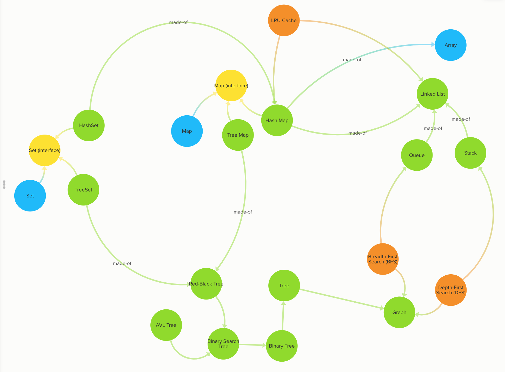

# 450 Data Structures and Algorithms

450 DSA Cracker helps you build your confidence in solving any coding
related question and helps you prepare for your placements 👨🏻‍🎓

[DSA Cracker Sheet](https://drive.google.com/file/d/1FMdN_OCfOI0iAeDlqswCiC2DZzD4nPsb/view) by [Love Babbar](https://www.linkedin.com/in/love-babbar-38ab2887/) 🙏🏻 ❤️

  

 

# [450 DSA Sheet](https://drive.google.com/file/d/1FMdN_OCfOI0iAeDlqswCiC2DZzD4nPsb/view)

## Arrays

| S.No.    | Topic:                | Problem                                                                                              | Solutions | Python | C++    | Java   |
| -------  |:---------------------:|------------------------------------------------------------------------------------------------------|:---------:|--------|--------|--------|
| 1        | `Array`               | Reverse the array  																																									|❌         |  |    |   |
| 2        | `Array`               | Find the maximum and minimum element in an array                                                     |❌         |  |    |   |
| 3        | `Array`               | Find the "Kth" max and min element of an array                                                       |❌         |  |    |   |
| 4        | `Array`               | Given an array which consists of only 0, 1 and 2. Sort the array without using any sorting algo      |❌         |  |    |   |
| 5        | `Array`               | Move all the negative elements to one side of the array                                              |❌         |  |    |   |
| 6        | `Array`               | Find the Union and Intersection of the two sorted arrays.                                            |❌         |  |    |   |
| 7        | `Array`               | Write a program to cyclically rotate an array by one.                                                |❌         |  |    |   |
| 8        | `Array`               | find Largest sum contiguous Subarray [V. IMP]                                                        |❌         |  |    |   |
| 9        | `Array`               | Minimise the maximum difference between heights [V.IMP]                                              |❌         |  |    |   |
| 10       | `Array`               | Minimum no. of Jumps to reach end of an array                                                        |❌         |  |    |   |
| 11       | `Array`               | find duplicate in an array of N+1 Integers                                                           |❌         |  |    |   |
| 12       | `Array`               | Merge 2 sorted arrays without using Extra space.                                                     |❌         |  |    |   |
| 13       | `Array`               | Kadane's Algo [V.V.V.V.V IMP]                                                                        |❌         |  |    |   |
| 14       | `Array`               | Merge Intervals                                                                                      |❌         |  |    |   |
| 15       | `Array`               | Next Permutation                                                                                     |❌         |  |    |   |
| 16       | `Array`               | Count Inversion                                                                                      |❌         |  |    |   |
| 17       | `Array`               | Best time to buy and Sell stock                                                                      |❌         |  |    |   |
| 18       | `Array`               | find all pairs on integer array whose sum is equal to given number                                   |❌         |  |    |   |
| 19       | `Array`               | find common elements In 3 sorted arrays                                                              |❌         |  |    |   |
| 20       | `Array`               | Rearrange the array in alternating positive and negative items with O(1) extra space                 |❌         |  |    |   |
| 21       | `Array`               | Find if there is any subarray with sum equal to 0                                                    |❌         |  |    |   |
| 22       | `Array`               | Find factorial of a large number                                                                     |❌         |  |    |   |
| 23       | `Array`               | find maximum product subarray                                                                        |❌         |  |    |   |
| 24       | `Array`               | Find longest coinsecutive subsequence                                                                |❌         |  |    |   |
| 25       | `Array`               | Given an array of size n and a number k, fin all elements that appear more than " n/k " times.       |❌         |  |    |   |
| 26       | `Array`               | Maximum profit by buying and selling a share atmost twice                                            |❌         |  |    |   |
| 27       | `Array`               | Find whether an array is a subset of another array                                                   |❌         |  |    |   |
| 28       | `Array`               | Find the triplet that sum to a given value                                                           |❌         |  |    |   |
| 29       | `Array`               | Trapping Rain water problem                                                                          |❌         |  |    |   |
| 30       | `Array`               | Chocolate Distribution problem                                                                       |❌         |  |    |   |
| 31       | `Array`               | Smallest Subarray with sum greater than a given value                                                |❌         |  |    |   |
| 32       | `Array`               | Three way partitioning of an array around a given value                                              |❌         |  |    |   |
| 33       | `Array`               | Minimum swaps required bring elements less equal K together                                          |❌         |  |    |   |
| 34       | `Array`               | Minimum no. of operations required to make an array palindrome                                       |❌         |  |    |   |
| 35       | `Array`               | Median of 2 sorted arrays of equal size                                                              |❌         |  |    |   |
| 36       | `Array`               | Median of 2 sorted arrays of different size                                                          |❌         |  |    |   |

 

    <b><a href="#450-dsa-sheet">⬆️ Back to Top</a></b>

 

## Matrix

      

| S.No.    | Topic:                | Problem                                                                                              | Solutions | Python | C++    | Java   |
| -------  |:---------------------:|------------------------------------------------------------------------------------------------------|:---------:|--------|--------|--------|
| 1        | `Matrix`              | Spiral traversal on a Matrix                                                                         |❌         |  |    |   |
| 2        | `Matrix`              | Search an element in a matriix                                                                       |❌         |  |    |   |
| 3        | `Matrix`              | Find median in a row wise sorted matrix                                                              |❌         |  |    |   |
| 4        | `Matrix`              | Find row with maximum no. of 1's                                                                     |❌         |  |    |   |
| 5        | `Matrix`              | Print elements in sorted order using row-column wise sorted matrix                                   |❌         |  |    |   |
| 6        | `Matrix`              | Maximum size rectangle                                                                               |❌         |  |    |   |
| 7        | `Matrix`              | Find a specific pair in matrix                                                                       |❌         |  |    |   |
| 8        | `Matrix`              | Rotate matrix by 90 degrees                                                                          |❌         |  |    |   |
| 9        | `Matrix`              | Kth smallest element in a row-cpumn wise sorted matrix                                               |❌         |  |    |   |
| 10       | `Matrix`              | Common elements in all rows of a given matrix                                                        |❌         |  |    |   |

 

    <b><a href="#450-dsa-sheet">⬆️ Back to Top</a></b>

 

## Strings

| S.No.     | Topic:                | Problem                                                                                              | Solutions | Python | C++    | Java   |
| --------  |:---------------------:|------------------------------------------------------------------------------------------------------|:---------:|--------|--------|--------|
| 1         | `String`              | Reverse a String                                                                                     |❌         |  |    |   |
| 2         | `String`              | Check whether a String is Palindrome or not                                                          |❌         |  |    |   |
| 3         | `String`              | Find Duplicate characters in a string                                                                |❌         |  |    |   |
| 4         | `String`              | Why strings are immutable in Java?                                                                   |❌         |  |    |   |
| 5         | `String`              | Write a Code to check whether one string is a rotation of another                                    |❌         |  |    |   |
| 6         | `String`              | Write a Program to check whether a string is a valid shuffle of two strings or not                   |❌         |  |    |   |
| 7         | `String`              | Count and Say problem                                                                                |❌         |  |    |   |
| 8         | `String`              | Write a program to find the longest Palindrome in a string.[ Longest palindromic Substring]          |❌         |  |    |   |
| 9         | `String`              | Find Longest Recurring Subsequence in String                                                         |❌         |  |    |   |
| 10        | `String`              | Print all Subsequences of a string.                                                                  |❌         |  |    |   |
| 11        | `String`              | Print all the permutations of the given string                                                       |❌         |  |    |   |
| 12        | `String`              | Split the Binary string into two substring with equal 0’s and 1’s                                    |❌         |  |    |   |
| 13        | `String`              | Word Wrap Problem [VERY IMP].                                                                        |❌         |  |    |   |
| 14        | `String`              | EDIT Distance [Very Imp]                                                                             |❌         |  |    |   |
| 15        | `String`              | Find next greater number with same set of digits. [Very Very IMP]                                    |❌         |  |    |   |
| 16        | `String`              | Balanced Parenthesis problem.[Imp]                                                                   |❌         |  |    |   |
| 17        | `String`              | Word break Problem[ Very Imp]                                                                        |❌         |  |    |   |
| 18        | `String`              | Rabin Karp Algo                                                                                      |❌         |  |    |   |
| 19        | `String`              | KMP Algo                                                                                             |❌         |  |    |   |
| 20        | `String`              | Convert a Sentence into its equivalent mobile numeric keypad sequence.                               |❌         |  |    |   |
| 21        | `String`              | Minimum number of bracket reversals needed to make an expression balanced.                           |❌         |  |    |   |
| 22        | `String`              | Count All Palindromic Subsequence in a given String.                                                 |❌         |  |    |   |
| 23        | `String`              | Count of number of given string in 2D character array                                                |❌         |  |    |   |
| 24        | `String`              | Search a Word in a 2D Grid of characters.                                                            |❌         |  |    |   |
| 25        | `String`              | Boyer Moore Algorithm for Pattern Searching.                                                         |❌         |  |    |   |
| 26        | `String`              | Converting Roman Numerals to Decimal                                                                 |❌         |  |    |   |
| 27        | `String`              | Longest Common Prefix                                                                                |❌         |  |    |   |
| 28        | `String`              | Number of flips to make binary string alternate                                                      |❌         |  |    |   |
| 29        | `String`              | Find the first repeated word in string.                                                              |❌         |  |    |   |
| 30        | `String`              | Minimum number of swaps for bracket balancing.                                                       |❌         |  |    |   |
| 31        | `String`              | Find the longest common subsequence between two strings.                                             |❌         |  |    |   |
| 32        | `String`              | Program to generate all possible valid IP addresses from given  string.                              |❌         |  |    |   |
| 33        | `String`              | Write a program tofind the smallest window that contains all characters of string itself.            |❌         |  |    |   |
| 34        | `String`              | Rearrange characters in a string such that no two adjacent are same                                  |❌         |  |    |   |
| 35        | `String`              | Minimum characters to be added at front to make string palindrome                                    |❌         |  |    |   |
| 36        | `String`              | Given a sequence of words, print all anagrams together                                               |❌         |  |    |   |
| 37        | `String`              | Find the smallest window in a string containing all characters of another string                     |❌         |  |    |   |
| 38        | `String`              | Recursively remove all adjacent duplicates                                                           |❌         |  |    |   |
| 39        | `String`              | String matching where one string contains wildcard characters                                        |❌         |  |    |   |
| 40        | `String`              | Function to find Number of customers who could not get a computer                                    |❌         |  |    |   |
| 41        | `String`              | Transform One String to Another using Minimum Number of Given Operation                              |❌         |  |    |   |
| 42        | `String`              | Check if two given strings are isomorphic to each other                                              |❌         |  |    |   |
| 43        | `String`              | Recursively print all sentences that can be formed from list of word lists                           |❌         |  |    |   |

 

    <b><a href="#450-dsa-sheet">⬆️ Back to Top</a></b>

 

## Searching and Sorting

| S.No.     | Topic:                | Problem                                                                                              | Solutions | Python | C++    | Java   |
| --------  |:---------------------:|------------------------------------------------------------------------------------------------------|:---------:|--------|--------|--------|
| 1         | `Searching & Sorting` | Find first and last positions of an element in a sorted array                                        |❌         |  |    |   |
| 2         | `Searching & Sorting` | Find a Fixed Point (Value equal to index) in a given array                                           |❌         |  |    |   |
| 3         | `Searching & Sorting` | Search in a rotated sorted array                                                                     |❌         |  |    |   |
| 4         | `Searching & Sorting` | square root of an integer                                                                            |❌         |  |    |   |
| 5         | `Searching & Sorting` | Maximum and minimum of an array using minimum number of comparisons                                  |❌         |  |    |   |
| 6         | `Searching & Sorting` | Optimum location of point to minimize total distance                                                 |❌         |  |    |   |
| 7         | `Searching & Sorting` | Find the repeating and the missing                                                                   |❌         |  |    |   |
| 8         | `Searching & Sorting` | find majority element                                                                                |❌         |  |    |   |
| 9         | `Searching & Sorting` | Searching in an array where adjacent differ by at most k                                             |❌         |  |    |   |
| 10        | `Searching & Sorting` | find a pair with a given difference                                                                  |❌         |  |    |   |
| 11        | `Searching & Sorting` | find four elements that sum to a given value                                                         |❌         |  |    |   |
| 12        | `Searching & Sorting` | maximum sum such that no 2 elements are adjacent                                                     |❌         |  |    |   |
| 13        | `Searching & Sorting` | Count triplet with sum smaller than a given value                                                    |❌         |  |    |   |
| 14        | `Searching & Sorting` | merge 2 sorted arrays                                                                                |❌         |  |    |   |
| 15        | `Searching & Sorting` | print all subarrays with 0 sum                                                                       |❌         |  |    |   |
| 16        | `Searching & Sorting` | Product array Puzzle                                                                                 |❌         |  |    |   |
| 17        | `Searching & Sorting` | Sort array according to count of set bits                                                            |❌         |  |    |   |
| 18        | `Searching & Sorting` | minimum no. of swaps required to sort the array                                                      |❌         |  |    |   |
| 19        | `Searching & Sorting` | Bishu and Soldiers                                                                                   |❌         |  |    |   |
| 20        | `Searching & Sorting` | Rasta and Kheshtak                                                                                   |❌         |  |    |   |
| 21        | `Searching & Sorting` | Kth smallest number again                                                                            |❌         |  |    |   |
| 22        | `Searching & Sorting` | Find pivot element in a sorted array                                                                 |❌         |  |    |   |
| 23        | `Searching & Sorting` | K-th Element of Two Sorted Arrays                                                                    |❌         |  |    |   |
| 24        | `Searching & Sorting` | Aggressive cows                                                                                      |❌         |  |    |   |
| 25        | `Searching & Sorting` | Book Allocation Problem                                                                              |❌         |  |    |   |
| 26        | `Searching & Sorting` | EKOSPOJ:                                                                                             |❌         |  |    |   |
| 27        | `Searching & Sorting` | Job Scheduling Algo                                                                                  |❌         |  |    |   |
| 28        | `Searching & Sorting` | Missing Number in AP                                                                                 |❌         |  |    |   |
| 29        | `Searching & Sorting` | Smallest number with atleastn trailing zeroes infactorial                                            |❌         |  |    |   |
| 30        | `Searching & Sorting` | Painters Partition Problem:                                                                          |❌         |  |    |   |
| 31        | `Searching & Sorting` | ROTI-Prata SPOJ                                                                                      |❌         |  |    |   |
| 32        | `Searching & Sorting` | DoubleHelix SPOJ                                                                                     |❌         |  |    |   |
| 33        | `Searching & Sorting` | Subset Sums                                                                                          |❌         |  |    |   |
| 34        | `Searching & Sorting` | Findthe inversion count                                                                              |❌         |  |    |   |
| 35        | `Searching & Sorting` | Implement Merge-sort in-place                                                                        |❌         |  |    |   |
| 36        | `Searching & Sorting` | Partitioning and Sorting Arrays with Many Repeated Entries                                           |❌         |  |    |   |

 

    <b><a href="#450-dsa-sheet">⬆️ Back to Top</a></b>

 

## Linked Lists

| S.No.     | Topic:              | Problem                                                                                              | Solutions | Python | C++    | Java   |
| --------  |:-------------------:|------------------------------------------------------------------------------------------------------|:---------:|--------|--------|--------|
| 1         | LinkedList          | Write a Program to reverse the Linked List. (Both Iterative and recursive)                           |❌         |  |    |   |
| 2         | LinkedList          | Reverse a Linked List in group of Given Size. [Very Imp]                                             |❌         |  |    |   |
| 3         | LinkedList          | Write a program to Detect loop in a linked list.                                                     |❌         |  |    |   |
| 4         | LinkedList          | Write a program to Delete loop in a linked list.                                                     |❌         |  |    |   |
| 5         | LinkedList          | Find the starting point of the loop.                                                                 |❌         |  |    |   |
| 6         | LinkedList          | Remove Duplicates in a sorted Linked List.                                                           |❌         |  |    |   |
| 7         | LinkedList          | Remove Duplicates in a Un-sorted Linked List.                                                        |❌         |  |    |   |
| 8         | LinkedList          | Write a Program to Move the last element to Front in a Linked List.                                  |❌         |  |    |   |
| 9         | LinkedList          | Add “1” to a number represented as a Linked List.                                                    |❌         |  |    |   |
| 10        | LinkedList          | Add two numbers represented by linked lists.                                                         |❌         |  |    |   |
| 11        | LinkedList          | Intersection of two Sorted Linked List.                                                              |❌         |  |    |   |
| 12        | LinkedList          | Intersection Point of two Linked Lists.                                                              |❌         |  |    |   |
| 13        | LinkedList          | Merge Sort For Linked lists.[Very Important]                                                         |❌         |  |    |   |
| 14        | LinkedList          | Quicksort for Linked Lists.[Very Important]                                                          |❌         |  |    |   |
| 15        | LinkedList          | Find the middle Element of a linked list.                                                            |❌         |  |    |   |
| 16        | LinkedList          | Check if a linked list is a circular linked list.                                                    |❌         |  |    |   |
| 17        | LinkedList          | Split a Circular linked list into two halves.                                                        |❌         |  |    |   |
| 18        | LinkedList          | Write a Program to check whether the Singly Linked list is a palindrome or not.                      |❌         |  |    |   |
| 19        | LinkedList          | Deletion from a Circular Linked List.                                                                |❌         |  |    |   |
| 20        | LinkedList          | Reverse a Doubly Linked list.                                                                        |❌         |  |    |   |
| 21        | LinkedList          | Find pairs with a given sum in a DLL.                                                                |❌         |  |    |   |
| 22        | LinkedList          | Count triplets in a sorted DLL whose sum is equal to given value “X”.                                |❌         |  |    |   |
| 23        | LinkedList          | Sort a “k”sorted Doubly Linked list.[Very IMP]                                                       |❌         |  |    |   |
| 24        | LinkedList          | Rotate DoublyLinked list by N nodes.                                                                 |❌         |  |    |   |
| 25        | LinkedList          | Rotate a Doubly Linked list in group of Given Size.[Very IMP]                                        |❌         |  |    |   |
| 26        | LinkedList          | Can we reverse a linked list in less than O(n) ?                                                     |❌         |  |    |   |
| 27        | LinkedList          | Why Quicksort is preferred for. Arrays and Merge Sort for LinkedLists ?                              |❌         |  |    |   |
| 28        | LinkedList          | Flatten a Linked List                                                                                |❌         |  |    |   |
| 29        | LinkedList          | Sort a LL of 0's, 1's and 2's                                                                        |❌         |  |    |   |
| 30        | LinkedList          | Clone a linked list with next and random pointer                                                     |❌         |  |    |   |
| 31        | LinkedList          | Merge K sorted Linked list                                                                           |❌         |  |    |   |
| 32        | LinkedList          | Multiply 2 no. represented by LL                                                                     |❌         |  |    |   |
| 33        | LinkedList          | Delete nodes which have a greater value on right side                                                |❌         |  |    |   |
| 34        | LinkedList          | Segregate even and odd nodes in a Linked List                                                        |❌         |  |    |   |
| 35        | LinkedList          | Program for n’th node from the end of a Linked List                                                  |❌         |  |    |   |
| 36        | LinkedList          | Find the first non-repeating character from a stream of characters                                   |❌         |  |    |   |

 

    <b><a href="#450-dsa-sheet">⬆️ Back to Top</a></b>

 

## Binary Trees

| S.No.     | Topic:              | Problem                                                                                              | Solutions | Python | C++    | Java   |
| --------  |:-------------------:|------------------------------------------------------------------------------------------------------|:---------:|--------|--------|--------|
| 1         | Binary Trees        | level order traversal                                                                                |❌         |  |    |   |
| 2         | Binary Trees        | Reverse Level Order traversal                                                                        |❌         |  |    |   |
| 3         | Binary Trees        | Height of a tree                                                                                     |❌         |  |    |   |
| 4         | Binary Trees        | Diameter of a tree                                                                                   |❌         |  |    |   |
| 5         | Binary Trees        | Mirror of a tree                                                                                     |❌         |  |    |   |
| 6         | Binary Trees        | Inorder Traversal of a tree both using recursion and Iteration                                       |❌         |  |    |   |
| 7         | Binary Trees        | Preorder Traversal of a tree both using recursion and Iteration                                      |❌         |  |    |   |
| 8         | Binary Trees        | Postorder Traversal of a tree both using recursion and Iteration                                     |❌         |  |    |   |
| 9         | Binary Trees        | Left View of a tree                                                                                  |❌         |  |    |   |
| 10        | Binary Trees        | Right View of Tree                                                                                   |❌         |  |    |   |
| 11        | Binary Trees        | Top View of a tree                                                                                   |❌         |  |    |   |
| 12        | Binary Trees        | Bottom View of a tree                                                                                |❌         |  |    |   |
| 13        | Binary Trees        | Zig-Zag traversal of a binary tree                                                                   |❌         |  |    |   |
| 14        | Binary Trees        | Check if a tree is balanced or not                                                                   |❌         |  |    |   |
| 15        | Binary Trees        | Diagnol Traversal of a Binary tree                                                                   |❌         |  |    |   |
| 16        | Binary Trees        | Boundary traversal of a Binary tree                                                                  |❌         |  |    |   |
| 17        | Binary Trees        | Construct Binary Tree from String with Bracket Representation                                        |❌         |  |    |   |
| 18        | Binary Trees        | Convert Binary tree into Doubly Linked List                                                          |❌         |  |    |   |
| 19        | Binary Trees        | Convert Binary tree into Sum tree                                                                    |❌         |  |    |   |
| 20        | Binary Trees        | Construct Binary tree from Inorder and preorder traversal                                            |❌         |  |    |   |
| 21        | Binary Trees        | Find minimum swaps required to convert a Binary tree into BST                                        |❌         |  |    |   |
| 22        | Binary Trees        | Check if Binary tree is Sum tree or not                                                              |❌         |  |    |   |
| 23        | Binary Trees        | Check if all leaf nodes are at same level or not                                                     |❌         |  |    |   |
| 24        | Binary Trees        | Check if a Binary Tree contains duplicate subtrees of size 2 or more [ IMP ]                         |❌         |  |    |   |
| 25        | Binary Trees        | Check if 2 trees are mirror or not                                                                   |❌         |  |    |   |
| 26        | Binary Trees        | Sum of Nodes on the Longest path from root to leaf node                                              |❌         |  |    |   |
| 27        | Binary Trees        | Check if given graph is tree or not.  [ IMP ]                                                        |❌         |  |    |   |
| 28        | Binary Trees        | Find Largest subtree sum in a tree                                                                   |❌         |  |    |   |
| 29        | Binary Trees        | Maximum Sum of nodes in Binary tree such that no two are adjacent                                    |❌         |  |    |   |
| 30        | Binary Trees        | Print all "K" Sum paths in a Binary tree                                                             |❌         |  |    |   |
| 31        | Binary Trees        | Find LCA in a Binary tree                                                                            |❌         |  |    |   |
| 32        | Binary Trees        | Find distance between 2 nodes in a Binary tree                                                       |❌         |  |    |   |
| 33        | Binary Trees        | Kth Ancestor of node in a Binary tree                                                                |❌         |  |    |   |
| 34        | Binary Trees        | Find all Duplicate subtrees in a Binary tree [ IMP ]                                                 |❌         |  |    |   |
| 35        | Binary Trees        | Tree Isomorphism Problem                                                                             |❌         |  |    |   |

 

    <b><a href="#450-dsa-sheet">⬆️ Back to Top</a></b>

 

## Binary Search Trees

| S.No.     | Topic:              | Problem                                                                                              | Solutions | Python | C++    | Java   |
| --------  |:-------------------:|------------------------------------------------------------------------------------------------------|:---------:|--------|--------|--------|
| 1         | Binary Search Trees | Fina a value in a BST                                                                                |❌         |  |    |   |
| 2         | Binary Search Trees | Deletion of a node in a BST                                                                          |❌         |  |    |   |
| 3         | Binary Search Trees | Find min and max value in a BST                                                                      |❌         |  |    |   |
| 4         | Binary Search Trees | Find inorder successor and inorder predecessor in a BST                                              |❌         |  |    |   |
| 5         | Binary Search Trees | Check if a tree is a BST or not                                                                      |❌         |  |    |   |
| 6         | Binary Search Trees | Populate Inorder successor of all nodes                                                              |❌         |  |    |   |
| 7         | Binary Search Trees | Find LCA  of 2 nodes in a BST                                                                        |❌         |  |    |   |
| 8         | Binary Search Trees | Construct BST from preorder traversal                                                                |❌         |  |    |   |
| 9         | Binary Search Trees | Convert Binary tree into BST                                                                         |❌         |  |    |   |
| 10        | Binary Search Trees | Convert a normal BST into a Balanced BST                                                             |❌         |  |    |   |
| 11        | Binary Search Trees | Merge two BST [ V.V.V>IMP ]                                                                          |❌         |  |    |   |
| 12        | Binary Search Trees | Find Kth largest element in a BST                                                                    |❌         |  |    |   |
| 13        | Binary Search Trees | Find Kth smallest element in a BST                                                                   |❌         |  |    |   |
| 14        | Binary Search Trees | Count pairs from 2 BST whose sum is equal to given value "X"                                         |❌         |  |    |   |
| 15        | Binary Search Trees | Find the median of BST in O(n) time and O(1) space                                                   |❌         |  |    |   |
| 16        | Binary Search Trees | Count BST ndoes that lie in a given range                                                            |❌         |  |    |   |
| 17        | Binary Search Trees | Replace every element with the least greater element on its right                                    |❌         |  |    |   |
| 18        | Binary Search Trees | Given "n" appointments, find the conflicting appointments                                            |❌         |  |    |   |
| 19        | Binary Search Trees | Check preorder is valid or not                                                                       |❌         |  |    |   |
| 20        | Binary Search Trees | Check whether BST contains Dead end                                                                  |❌         |  |    |   |
| 21        | Binary Search Trees | Largest BST in a Binary Tree [ V.V.V.V.V IMP ]                                                       |❌         |  |    |   |
| 22        | Binary Search Trees | Flatten BST to sorted list                                                                           |❌         |  |    |   |

 

    <b><a href="#450-dsa-sheet">⬆️ Back to Top</a></b>

 

## Greedy

 

| S.No.     | Topic:              | Problem                                                                                              | Solutions | Python | C++    | Java   |
| --------  |:-------------------:|------------------------------------------------------------------------------------------------------|:---------:|--------|--------|--------|
| 1         | Greedy              | Activity Selection Problem                                                                           |❌         |  |    |   |
| 2         | Greedy              | Job SequencingProblem                                                                                |❌         |  |    |   |
| 3         | Greedy              | Huffman Coding                                                                                       |❌         |  |    |   |
| 4         | Greedy              | Water Connection Problem                                                                             |❌         |  |    |   |
| 5         | Greedy              | Fractional Knapsack Problem                                                                          |❌         |  |    |   |
| 6         | Greedy              | Greedy Algorithm to find Minimum number of Coins                                                     |❌         |  |    |   |
| 7         | Greedy              | Maximum trains for which stoppage can be provided                                                    |❌         |  |    |   |
| 8         | Greedy              | Minimum Platforms Problem                                                                            |❌         |  |    |   |
| 9         | Greedy              | Buy Maximum Stocks if i stocks can be bought on i-th day                                             |❌         |  |    |   |
| 10        | Greedy              | Find the minimum and maximum amount to buy all N candies                                             |❌         |  |    |   |
| 11        | Greedy              | Minimize Cash Flow among a given set of friends who have borrowed money from each other              |❌         |  |    |   |
| 12        | Greedy              | Minimum Cost to cut a board into squares                                                             |❌         |  |    |   |
| 13        | Greedy              | Check if it is possible to survive on Island                                                         |❌         |  |    |   |
| 14        | Greedy              | Find maximum meetings in one room                                                                    |❌         |  |    |   |
| 15        | Greedy              | Maximum product subset of an array                                                                   |❌         |  |    |   |
| 16        | Greedy              | Maximize array sum after K negations                                                                 |❌         |  |    |   |
| 17        | Greedy              | Maximize the sum of arr[i]*i                                                                         |❌         |  |    |   |
| 18        | Greedy              | Maximum sum of absolute difference of an array                                                       |❌         |  |    |   |
| 19        | Greedy              | Maximize sum of consecutive differences in a circular array                                          |❌         |  |    |   |
| 20        | Greedy              | Minimum sum of absolute difference of pairs of two arrays                                            |❌         |  |    |   |
| 21        | Greedy              | Program for Shortest Job First (or SJF) CPU Scheduling                                               |❌         |  |    |   |
| 22        | Greedy              | Program for Least Recently Used (LRU) Page Replacement algorithm                                     |❌         |  |    |   |
| 23        | Greedy              | Smallest subset with sum greater than all other elements                                             |❌         |  |    |   |
| 24        | Greedy              | Chocolate Distribution Problem                                                                       |❌         |  |    |   |
| 25        | Greedy              | DEFKIN -Defense of a Kingdom                                                                         |❌         |  |    |   |
| 26        | Greedy              | DIEHARD -DIE HARD                                                                                    |❌         |  |    |   |
| 27        | Greedy              | GERGOVIA -Wine trading in Gergovia                                                                   |❌         |  |    |   |
| 28        | Greedy              | Picking Up Chicks                                                                                    |❌         |  |    |   |
| 29        | Greedy              | CHOCOLA –Chocolate                                                                                   |❌         |  |    |   |
| 30        | Greedy              | ARRANGE -Arranging Amplifiers                                                                        |❌         |  |    |   |
| 31        | Greedy              | K Centers Problem                                                                                    |❌         |  |    |   |
| 32        | Greedy              | Minimum Cost of ropes                                                                                |❌         |  |    |   |
| 33        | Greedy              | Find smallest number with given number of digits and sum of digits                                   |❌         |  |    |   |
| 34        | Greedy              | Rearrange characters in a string such that no two adjacent are same                                  |❌         |  |    |   |
| 35        | Greedy              | Find maximum sum possible equal sum of three stacks                                                  |❌         |  |    |   |

 

    <b><a href="#450-dsa-sheet">⬆️ Back to Top</a></b>

 

## Backtracking

 

| S.No.     | Topic:              | Problem                                                                                              | Solutions | Python | C++    | Java   |
| --------  |:-------------------:|------------------------------------------------------------------------------------------------------|:---------:|--------|--------|--------|
| 1         | BackTracking        | Rat in a maze Problem                                                                                |❌         |  |    |   |
| 2         | BackTracking        | Printing all solutions in N-Queen Problem                                                            |❌         |  |    |   |
| 3         | BackTracking        | Word Break Problem using Backtracking                                                                |❌         |  |    |   |
| 4         | BackTracking        | Remove Invalid Parentheses                                                                           |❌         |  |    |   |
| 5         | BackTracking        | Sudoku Solver                                                                                        |❌         |  |    |   |
| 6         | BackTracking        | m Coloring Problem                                                                                   |❌         |  |    |   |
| 7         | BackTracking        | Print all palindromic partitions of a string                                                         |❌         |  |    |   |
| 8         | BackTracking        | Subset Sum Problem                                                                                   |❌         |  |    |   |
| 9         | BackTracking        | The Knight’s tour problem                                                                            |❌         |  |    |   |
| 10        | BackTracking        | Tug of War                                                                                           |❌         |  |    |   |
| 11        | BackTracking        | Find shortest safe route in a path with landmines                                                    |❌         |  |    |   |
| 12        | BackTracking        | Combinational Sum                                                                                    |❌         |  |    |   |
| 13        | BackTracking        | Find Maximum number possible by doing at-most K swaps                                                |❌         |  |    |   |
| 14        | BackTracking        | Print all permutations of a string                                                                   |❌         |  |    |   |
| 15        | BackTracking        | Find if there is a path of more than k length from a source                                          |❌         |  |    |   |
| 16        | BackTracking        | Longest Possible Route in a Matrix with Hurdles                                                      |❌         |  |    |   |
| 17        | BackTracking        | Print all possible paths from top left to bottom right of a mXn matrix                               |❌         |  |    |   |
| 18        | BackTracking        | Partition of a set intoK subsets with equal sum                                                      |❌         |  |    |   |
| 19        | BackTracking        | Find the K-th Permutation Sequence of first N natural numbers                                        |❌         |  |    |   |

 

    <b><a href="#450-dsa-sheet">⬆️ Back to Top</a></b>

 

## Stacks and Queues

 

| S.No.     | Topic:              | Problem                                                                                              | Solutions | Python | C++    | Java   |
| --------  |:-------------------:|------------------------------------------------------------------------------------------------------|:---------:|--------|--------|--------|
| 1         | Stacks & Queues     | Implement Stack from Scratch                                                                         |❌         |  |    |   |
| 2         | Stacks & Queues     | Implement Queue from Scratch                                                                         |❌         |  |    |   |
| 3         | Stacks & Queues     | Implement 2 stack in an array                                                                        |❌         |  |    |   |
| 4         | Stacks & Queues     | find the middle element of a stack                                                                   |❌         |  |    |   |
| 5         | Stacks & Queues     | Implement "N" stacks in an Array                                                                     |❌         |  |    |   |
| 6         | Stacks & Queues     | Check the expression has valid or Balanced parenthesis or not.                                       |❌         |  |    |   |
| 7         | Stacks & Queues     | Reverse a String using Stack                                                                         |❌         |  |    |   |
| 8         | Stacks & Queues     | Design a Stack that supports getMin() in O(1) time and O(1) extra space.                             |❌         |  |    |   |
| 9         | Stacks & Queues     | Find the next Greater element                                                                        |❌         |  |    |   |
| 10        | Stacks & Queues     | The celebrity Problem                                                                                |❌         |  |    |   |
| 11        | Stacks & Queues     | Arithmetic Expression evaluation                                                                     |❌         |  |    |   |
| 12        | Stacks & Queues     | Evaluation of Postfix expression                                                                     |❌         |  |    |   |
| 13        | Stacks & Queues     | Implement a method to insert an element at its bottom without using any other data structure.        |❌         |  |    |   |
| 14        | Stacks & Queues     | Reverse a stack using recursion                                                                      |❌         |  |    |   |
| 15        | Stacks & Queues     | Sort a Stack using recursion                                                                         |❌         |  |    |   |
| 16        | Stacks & Queues     | Merge Overlapping Intervals                                                                          |❌         |  |    |   |
| 17        | Stacks & Queues     | Largest rectangular Area in Histogram                                                                |❌         |  |    |   |
| 18        | Stacks & Queues     | Length of the Longest Valid Substring                                                                |❌         |  |    |   |
| 19        | Stacks & Queues     | Expression contains redundant bracket or not                                                         |❌         |  |    |   |
| 20        | Stacks & Queues     | Implement Stack using Queue                                                                          |❌         |  |    |   |
| 21        | Stacks & Queues     | Implement Stack using Deque                                                                          |❌         |  |    |   |
| 22        | Stacks & Queues     | Stack Permutations (Check if an array is stack permutation of other)                                 |❌         |  |    |   |
| 23        | Stacks & Queues     | Implement Queue using Stack                                                                          |❌         |  |    |   |
| 24        | Stacks & Queues     | Implement "n" queue in an array                                                                      |❌         |  |    |   |
| 25        | Stacks & Queues     | Implement a Circular queue                                                                           |❌         |  |    |   |
| 26        | Stacks & Queues     | LRU Cache Implementationa                                                                            |❌         |  |    |   |
| 27        | Stacks & Queues     | Reverse a Queue using recursion                                                                      |❌         |  |    |   |
| 28        | Stacks & Queues     | Reverse the first “K” elements of a queue                                                            |❌         |  |    |   |
| 29        | Stacks & Queues     | Interleave the first half of the queue with second half                                              |❌         |  |    |   |
| 30        | Stacks & Queues     | Find the first circular tour that visits all Petrol Pumps                                            |❌         |  |    |   |
| 31        | Stacks & Queues     | Minimum time required to rot all oranges                                                             |❌         |  |    |   |
| 32        | Stacks & Queues     | Distance of nearest cell having 1 in a binary matrix                                                 |❌         |  |    |   |
| 33        | Stacks & Queues     | First negative integer in every window of size “k”                                                   |❌         |  |    |   |
| 34        | Stacks & Queues     | Check if all levels of two trees are anagrams or not.                                                |❌         |  |    |   |
| 35        | Stacks & Queues     | Sum of minimum and maximum elements of all subarrays of size “k”.                                    |❌         |  |    |   |
| 36        | Stacks & Queues     | Minimum sum of squares of character counts in a given string after removing “k” characters.          |❌         |  |    |   |
| 37        | Stacks & Queues     | Queue based approach or first non-repeating character in a stream.                                   |❌         |  |    |   |
| 38        | Stacks & Queues     | Next Smaller Element                                                                                 |❌         |  |    |   |

 

    <b><a href="#450-dsa-sheet">⬆️ Back to Top</a></b>

 

## Heap

| S.No.     | Topic:              | Problem                                                                                              | Solutions | Python | C++    | Java   |
| --------  |:-------------------:|------------------------------------------------------------------------------------------------------|:---------:|--------|--------|--------|
| 1         | Heap                | Implement a Maxheap/MinHeap using arrays and recursion.                                              |❌         |  |    |   |
| 2         | Heap                | Sort an Array using heap. (HeapSort)                                                                 |❌         |  |    |   |
| 3         | Heap                | Maximum of all subarrays of size k.                                                                  |❌         |  |    |   |
| 4         | Heap                | “k” largest element in an array                                                                      |❌         |  |    |   |
| 5         | Heap                | Kth smallest and largest element in an unsorted array                                                |❌         |  |    |   |
| 6         | Heap                | Merge “K” sorted arrays. [ IMP ]                                                                     |❌         |  |    |   |
| 7         | Heap                | Merge 2 Binary Max Heaps                                                                             |❌         |  |    |   |
| 8         | Heap                | Kth largest sum continuous subarrays                                                                 |❌         |  |    |   |
| 9         | Heap                | Leetcode- reorganize strings                                                                         |❌         |  |    |   |
| 10        | Heap                | Merge “K” Sorted Linked Lists [V.IMP]                                                                |❌         |  |    |   |
| 11        | Heap                | Smallest range in “K” Lists                                                                          |❌         |  |    |   |
| 12        | Heap                | Median in a stream of Integers                                                                       |❌         |  |    |   |
| 13        | Heap                | Check if a Binary Tree is Heap                                                                       |❌         |  |    |   |
| 14        | Heap                | Connect “n” ropes with minimum cost                                                                  |❌         |  |    |   |
| 15        | Heap                | Convert BST to Min Heap                                                                              |❌         |  |    |   |
| 16        | Heap                | Convert min heap to max heap                                                                         |❌         |  |    |   |
| 17        | Heap                | Rearrange characters in a string such that no two adjacent are same.                                 |❌         |  |    |   |
| 18        | Heap                | Minimum sum of two numbers formed from digits of an array                                            |❌         |  |    |   |

 

    <b><a href="#450-dsa-sheet">⬆️ Back to Top</a></b>

 

## Graphs

| S.No.     | Topic:              | Problem                                                                                              | Solutions | Python | C++    | Java   |
| --------  |:-------------------:|------------------------------------------------------------------------------------------------------|:---------:|--------|--------|--------|
| 1         | Graph               | Create a Graph, print it                                                                             |❌         |  |    |   |
| 2         | Graph               | Implement BFS algorithm                                                                              |❌         |  |    |   |
| 3         | Graph               | Implement DFS Algo                                                                                   |❌         |  |    |   |
| 4         | Graph               | Detect Cycle in Directed Graph using BFS/DFS Algo                                                    |❌         |  |    |   |
| 5         | Graph               | Detect Cycle in UnDirected Graph using BFS/DFS Algo                                                  |❌         |  |    |   |
| 6         | Graph               | Search in a Maze                                                                                     |❌         |  |    |   |
| 7         | Graph               | Minimum Step by Knight                                                                               |❌         |  |    |   |
| 8         | Graph               | flood fill algo                                                                                      |❌         |  |    |   |
| 9         | Graph               | Clone a graph                                                                                        |❌         |  |    |   |
| 10        | Graph               | Making wired Connections                                                                             |❌         |  |    |   |
| 11        | Graph               | word Ladder                                                                                          |❌         |  |    |   |
| 12        | Graph               | Dijkstra algo                                                                                        |❌         |  |    |   |
| 13        | Graph               | Implement Topological Sort                                                                           |❌         |  |    |   |
| 14        | Graph               | Minimum time taken by each job to be completed given by a Directed Acyclic Graph                     |❌         |  |    |   |
| 15        | Graph               | Find whether it is possible to finish all tasks or not from given dependencies                       |❌         |  |    |   |
| 16        | Graph               | Find the no. of Isalnds                                                                              |❌         |  |    |   |
| 17        | Graph               | Given a sorted Dictionary of an Alien Language, find order of characters                             |❌         |  |    |   |
| 18        | Graph               | Implement Kruksal’sAlgorithm                                                                         |❌         |  |    |   |
| 19        | Graph               | Implement Prim’s Algorithm                                                                           |❌         |  |    |   |
| 20        | Graph               | Total no. of Spanning tree in a graph                                                                |❌         |  |    |   |
| 21        | Graph               | Implement Bellman Ford Algorithm                                                                     |❌         |  |    |   |
| 22        | Graph               | Implement Floyd warshallAlgorithm                                                                    |❌         |  |    |   |
| 23        | Graph               | Travelling Salesman Problem                                                                          |❌         |  |    |   |
| 24        | Graph               | Graph ColouringProblem                                                                               |❌         |  |    |   |
| 25        | Graph               | Snake and Ladders Problem                                                                            |❌         |  |    |   |
| 26        | Graph               | Find bridge in a graph                                                                               |❌         |  |    |   |
| 27        | Graph               | Count Strongly connected Components(Kosaraju Algo)                                                   |❌         |  |    |   |
| 28        | Graph               | Check whether a graph is Bipartite or Not                                                            |❌         |  |    |   |
| 29        | Graph               | Detect Negative cycle in a graph                                                                     |❌         |  |    |   |
| 30        | Graph               | Longest path in a Directed Acyclic Graph                                                             |❌         |  |    |   |
| 31        | Graph               | Journey to the Moon                                                                                  |❌         |  |    |   |
| 32        | Graph               | Cheapest Flights Within K Stops                                                                      |❌         |  |    |   |
| 33        | Graph               | Oliver and the Game                                                                                  |❌         |  |    |   |
| 34        | Graph               | Water Jug problem using BFS                                                                          |❌         |  |    |   |
| 35        | Graph               | Water Jug problem using BFS                                                                          |❌         |  |    |   |
| 36        | Graph               | Find if there is a path of more thank length from a source                                           |❌         |  |    |   |
| 37        | Graph               | M-ColouringProblem                                                                                   |❌         |  |    |   |
| 38        | Graph               | Minimum edges to reverse o make path from source to destination                                      |❌         |  |    |   |
| 39        | Graph               | Paths to travel each nodes using each edge(Seven Bridges)                                            |❌         |  |    |   |
| 40        | Graph               | Vertex Cover Problem                                                                                 |❌         |  |    |   |
| 41        | Graph               | Chinese Postman or Route Inspection                                                                  |❌         |  |    |   |
| 42        | Graph               | Number of Triangles in a Directed and Undirected Graph                                               |❌         |  |    |   |
| 43        | Graph               | Minimise the cashflow among a given set of friends who have borrowed money from each other           |❌         |  |    |   |
| 44        | Graph               | Two Clique Problem                                                                                   |❌         |  |    |   |

 

    <b><a href="#450-dsa-sheet">⬆️ Back to Top</a></b>

 

## Trie

| S.No.     | Topic:              | Problem                                                                                              | Solutions | Python | C++    | Java   |
| --------  |:-------------------:|------------------------------------------------------------------------------------------------------|:---------:|--------|--------|--------|
| 1         | Trie                | Construct a trie from scratch                                                                        |❌         |  |    |   |
| 2         | Trie                | Find shortest unique prefix for every word in a given list                                           |❌         |  |    |   |
| 3         | Trie                | Word Break Problem \| (Trie solution)                                                                |❌         |  |    |   |
| 4         | Trie                | Given a sequence of words, print all anagrams together                                               |❌         |  |    |   |
| 5         | Trie                | Implement a Phone Directory                                                                          |❌         |  |    |   |
| 6         | Trie                | Print unique rows in a given boolean matrix                                                          |❌         |  |    |   |

 

    <b><a href="#450-dsa-sheet">⬆️ Back to Top</a></b>

 

## Dynamic Programming

| S.No.     | Topic:              | Problem                                                                                              | Solutions | Python | C++    | Java   |
| --------  |:-------------------:|------------------------------------------------------------------------------------------------------|:---------:|--------|--------|--------|
| 1         | Dynamic Programming | Coin ChangeProblem                                                                                   |❌         |  |    |   |
| 2         | Dynamic Programming | Knapsack Problem                                                                                     |❌         |  |    |   |
| 3         | Dynamic Programming | Binomial CoefficientProblem                                                                          |❌         |  |    |   |
| 4         | Dynamic Programming | Permutation CoefficientProblem                                                                       |❌         |  |    |   |
| 5         | Dynamic Programming | Program for nth Catalan Number                                                                       |❌         |  |    |   |
| 6         | Dynamic Programming | Matrix Chain Multiplication                                                                          |❌         |  |    |   |
| 7         | Dynamic Programming | Edit Distance                                                                                        |❌         |  |    |   |
| 8         | Dynamic Programming | Subset Sum Problem                                                                                   |❌         |  |    |   |
| 9         | Dynamic Programming | Friends Pairing Problem                                                                              |❌         |  |    |   |
| 10        | Dynamic Programming | Gold Mine Problem                                                                                    |❌         |  |    |   |
| 11        | Dynamic Programming | Assembly Line SchedulingProblem                                                                      |❌         |  |    |   |
| 12        | Dynamic Programming | Painting the Fenceproblem                                                                            |❌         |  |    |   |
| 13        | Dynamic Programming | Maximize The Cut Segments                                                                            |❌         |  |    |   |
| 14        | Dynamic Programming | Longest Common Subsequence                                                                           |❌         |  |    |   |
| 15        | Dynamic Programming | Longest Repeated Subsequence                                                                         |❌         |  |    |   |
| 16        | Dynamic Programming | Longest Increasing Subsequence                                                                       |❌         |  |    |   |
| 17        | Dynamic Programming | Space Optimized Solution of LCS                                                                      |❌         |  |    |   |
| 18        | Dynamic Programming | LCS (Longest Common Subsequence) of three strings                                                    |❌         |  |    |   |
| 19        | Dynamic Programming | Maximum Sum Increasing Subsequence                                                                   |❌         |  |    |   |
| 20        | Dynamic Programming | Count all subsequences having product less than K                                                    |❌         |  |    |   |
| 21        | Dynamic Programming | Longest subsequence such that difference between adjacent is one                                     |❌         |  |    |   |
| 22        | Dynamic Programming | Maximum subsequence sum such that no three are consecutive                                           |❌         |  |    |   |
| 23        | Dynamic Programming | Egg Dropping Problem                                                                                 |❌         |  |    |   |
| 24        | Dynamic Programming | Maximum Length Chain of Pairs                                                                        |❌         |  |    |   |
| 25        | Dynamic Programming | Maximum size square sub-matrix with all 1s                                                           |❌         |  |    |   |
| 26        | Dynamic Programming | Maximum sum of pairs with specific difference                                                        |❌         |  |    |   |
| 27        | Dynamic Programming | Min Cost PathProblem                                                                                 |❌         |  |    |   |
| 28        | Dynamic Programming | Maximum difference of zeros and ones in binary string                                                |❌         |  |    |   |
| 29        | Dynamic Programming | Minimum number of jumps to reach end                                                                 |❌         |  |    |   |
| 30        | Dynamic Programming | Minimum cost to fill given weight in a bag                                                           |❌         |  |    |   |
| 31        | Dynamic Programming | Minimum removals from array to make max –min <= K                                                    |❌         |  |    |   |
| 32        | Dynamic Programming | Longest Common Substring                                                                             |❌         |  |    |   |
| 33        | Dynamic Programming | Count number of ways to reacha given score in a game                                                 |❌         |  |    |   |
| 34        | Dynamic Programming | Count Balanced Binary Trees of Height h                                                              |❌         |  |    |   |
| 35        | Dynamic Programming | LargestSum Contiguous Subarray [V>V>V>V IMP ]                                                        |❌         |  |    |   |
| 36        | Dynamic Programming | Smallest sum contiguous subarray                                                                     |❌         |  |    |   |
| 37        | Dynamic Programming | Unbounded Knapsack (Repetition of items allowed)                                                     |❌         |  |    |   |
| 38        | Dynamic Programming | Word Break Problem                                                                                   |❌         |  |    |   |
| 39        | Dynamic Programming | Largest Independent Set Problem                                                                      |❌         |  |    |   |
| 40        | Dynamic Programming | Partition problem                                                                                    |❌         |  |    |   |
| 41        | Dynamic Programming | Longest Palindromic Subsequence                                                                      |❌         |  |    |   |
| 42        | Dynamic Programming | Count All Palindromic Subsequence in a given String                                                  |❌         |  |    |   |
| 43        | Dynamic Programming | Longest Palindromic Substring                                                                        |❌         |  |    |   |
| 44        | Dynamic Programming | Longest alternating subsequence                                                                      |❌         |  |    |   |
| 45        | Dynamic Programming | Weighted Job Scheduling                                                                              |❌         |  |    |   |
| 46        | Dynamic Programming | Coin game winner where every player has three choices                                                |❌         |  |    |   |
| 47        | Dynamic Programming | Count Derangements (Permutation such that no element appears in its original position) [ IMPORTANT ] |❌         |  |    |   |
| 48        | Dynamic Programming | Maximum profit by buying and selling a share at most twice [ IMP ]                                   |❌         |  |    |   |
| 49        | Dynamic Programming | Optimal Strategy for a Game                                                                          |❌         |  |    |   |
| 50        | Dynamic Programming | Optimal Binary Search Tree                                                                           |❌         |  |    |   |
| 51        | Dynamic Programming | Palindrome PartitioningProblem                                                                       |❌         |  |    |   |
| 52        | Dynamic Programming | Word Wrap Problem                                                                                    |❌         |  |    |   |
| 53        | Dynamic Programming | Mobile Numeric Keypad Problem [ IMP ]                                                                |❌         |  |    |   |
| 54        | Dynamic Programming | Boolean Parenthesization Problem                                                                     |❌         |  |    |   |
| 55        | Dynamic Programming | Largest rectangular sub-matrix whose sum is 0                                                        |❌         |  |    |   |
| 56        | Dynamic Programming | Largest area rectangular sub-matrix with equal number of 1’s and 0’s [ IMP ]                         |❌         |  |    |   |
| 57        | Dynamic Programming | Maximum sum rectangle in a 2D matrix                                                                 |❌         |  |    |   |
| 58        | Dynamic Programming | Maximum profit by buying and selling a share at most k times                                         |❌         |  |    |   |
| 59        | Dynamic Programming | Find if a string is interleaved of two other strings                                                 |❌         |  |    |   |
| 60        | Dynamic Programming | Maximum Length of Pair Chain                                                                         |❌         |  |    |   |

 

    <b><a href="#450-dsa-sheet">⬆️ Back to Top</a></b>

 

## Bit Manipulation

| S.No.     | Topic:              | Problem                                                                                              | Solutions | Python | C++    | Java   |
| --------  |:-------------------:|------------------------------------------------------------------------------------------------------|:---------:|--------|--------|--------|
| 1         | Bit Manipulation    | Count set bits in an integer                                                                         |❌         |  |    |   |
| 2         | Bit Manipulation    | Find the two non-repeating elements in an array of repeating elements                                |❌         |  |    |   |
| 3         | Bit Manipulation    | Count number of bits to be flipped to convert A to B                                                 |❌         |  |    |   |
| 4         | Bit Manipulation    | Count total set bits in all numbers from 1 to n                                                      |❌         |  |    |   |
| 5         | Bit Manipulation    | Program to find whether a no is power of two                                                         |❌         |  |    |   |
| 6         | Bit Manipulation    | Find position of the only set bit                                                                    |❌         |  |    |   |
| 7         | Bit Manipulation    | Copy set bits in a range                                                                             |❌         |  |    |   |
| 8         | Bit Manipulation    | Divide two integers without using multiplication, division and mod operator                          |❌         |  |    |   |
| 9         | Bit Manipulation    | Calculate square of a number without using *, / and pow()                                            |❌         |  |    |   |
| 10        | Bit Manipulation    | Power Set                                                                                            |❌         |  |    |   |

 

    <b><a href="#450-dsa-sheet">⬆️ Back to Top</a></b>

 

## ❤️ Project Admin

<table>
	<tr>
		<td align="center">
			<a href="https://github.com/shubhigupta991">
				
				  <b>Shubhangi Gupta</b>
			</a>
			  <a href="https://github.com/shubhigupta991">
		👑 Admin
	    </a>
		</td>
	</tr>
</table>

## Discord

## License

This project follows the [MIT License](https://github.com/CodeTrophs/450DSA/blob/main/LICENSE).

